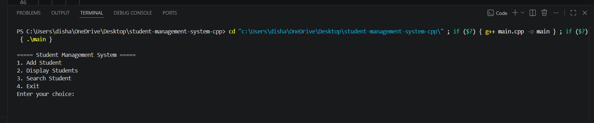
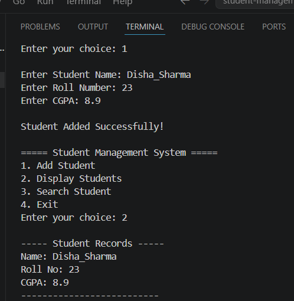
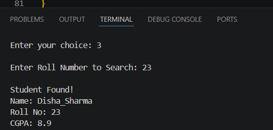

# 🎓 Student Management System (C++)

A simple **console-based Student Management System** developed using **C++**. This project demonstrates the use of fundamental C++ concepts to manage student records through a menu-driven interface.

## ✨ Features

* ➕ Add Student
* 📋 Display Student Records
* 🔍 Search Student by Roll Number
* 🚪 Exit Program
* 📌 Menu-Driven Interface

## 🛠️ Technologies Used

* C++
* Visual Studio Code
* Git
* GitHub

## 📚 Concepts Practiced

* Functions
* Structures (`struct`)
* Arrays
* Loops
* Conditional Statements
* User Input & Output
* Modular Programming

## 📸 Screenshots

### Main Menu

### Add & Display Student

### Search Student

## 🚀 How to Run

1. Clone the repository.
2. Open the project in Visual Studio Code.
3. Compile the program using a C++ compiler.
4. Run the executable.

## 🎯 Future Improvements

* Update Student Details
* Delete Student Record
* File Handling for Data Storage
* Input Validation

## 👩‍💻 Author

**Disha Sharma**

* GitHub: https://github.com/disha-codes-cpp
* LinkedIn: https://www.linkedin.com/in/disha-sharma-cse

